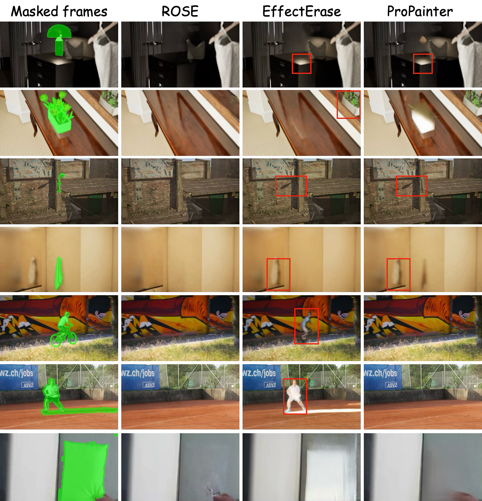

# Video Object Removal Benchmark

This repository compares three video object-removal methods on the
**ROSE-Benchmark** plus arbitrary in-the-wild clips:

- **ROSE** &mdash; diffusion-based removal (Wan2.1-Fun-1.3B-InP backbone).
- **EffectErase** &mdash; LoRA-tuned Wan2.1 inpainting pipeline.
- **ProPainter** &mdash; flow-guided propagation + transformer inpainter.

## Qualitative Comparison

The columns show the masked input frame and the inpainting result of each
method. Red boxes highlight residual artefacts.



## Datasets

| Dataset             | Source                                            | Layout used by the scripts                                                                |
| ------------------- | ------------------------------------------------- | ----------------------------------------------------------------------------------------- |
| **ROSE-Benchmark**  | `Kunbyte/ROSE-Dataset` on HuggingFace             | `ROSE-Benchmark/Benchmark/<category>/{Unedited,Masked,Edited}/example-<id>.mp4` (6 categories: `common`, `light_source`, `mirror`, `reflection`, `shadow`, `transcluent`) |
| **Wild videos**     | User-supplied clips                               | `wild_videos/<name>.mp4` + `wild_videos/<name>_mask.mp4`                                  |

> The video / mask datasets and any inference outputs are **not** committed
> to this repository. After cloning, prepare them locally as described below.

Download ROSE-Benchmark:

```bash
python download_roseben.py            # writes to ./ROSE-Benchmark
```

## Repository Layout

```
cv_project/
├── README.md
├── assets/
│   └── cv_quali.png                  # Qualitative comparison figure
│
├── ROSE/                             # ROSE inference code  (conda env: rose)
├── EffectErase/                      # EffectErase code     (conda env: effecterase)
├── ProPainter/                       # ProPainter code      (conda env: propainter)
│
├── ROSE-Benchmark/                   # Test set (downloaded, not in git)
│   └── Benchmark/<category>/
│       ├── Unedited/example-<id>.mp4 # Input clip
│       ├── Masked/example-<id>.mp4   # Object mask
│       ├── Edited/example-<id>.mp4   # Ground truth
│       └── predicted/                # Created by inference scripts
│           ├── rose/example-<id>.mp4
│           ├── effecterase/example-<id>.mp4
│           └── propainter/example-<id>.mp4
│
├── wild_videos/                      # In-the-wild clips (not in git)
│   ├── <name>.mp4                    # Source video
│   ├── <name>_mask.mp4               # Binary mask video
│   └── inference_outputs/{rose,effecterase,propainter}/<name>.mp4
│
├── inference_all.sh                  # Run 3 methods on the Benchmark
├── run_wild_inference.sh             # Run 3 methods on a wild_videos pair
├── run_inference_all_queue.sh        # SLURM wrapper for inference_all.sh
├── run_eval_all_queue.sh             # SLURM wrapper for eval_all.py
│
├── eval_all.py                       # Unified PSNR/SSIM/MSE/MAE/LPIPS/VFID evaluator
├── re_index.py                       # Rename ROSE outputs to Unedited basenames
└── download_roseben.py               # Pull ROSE-Benchmark from HuggingFace
```

## Environment Setup

Each method has its own conda environment. The shell scripts handle the
`conda activate` calls for you; only set the envs up once.

```bash
conda create -n rose         python=3.10 -y
conda create -n effecterase  python=3.10 -y
conda create -n propainter   python=3.10 -y
```

Install the dependencies of each method inside its own env (see
`ROSE/README.md`, `EffectErase/README.md`, `ProPainter/README.md`).

Required model weights:

| Method      | Weights                                                                                |
| ----------- | -------------------------------------------------------------------------------------- |
| ROSE        | `ROSE/models/Wan2.1-Fun-1.3B-InP`, `ROSE/weights/transformer`                          |
| EffectErase | `EffectErase/Wan-AI/Wan2.1-Fun-1.3B-InP/*.pth` + `EffectErase/EffectErase.ckpt` (LoRA) |
| ProPainter  | weights downloaded by `ProPainter/weights/download_sam_ckpt.sh`; plus `ProPainter/weights/i3d_rgb_imagenet.pt` for VFID |

## Inference

### 1. ROSE-Benchmark (all three methods)

```bash
bash inference_all.sh
# Optional:
CUDA_VISIBLE_DEVICES=0 bash inference_all.sh
```

The script iterates `Benchmark/<category>/Unedited/example-*.mp4`, pairs each
clip with its mask in `Benchmark/<category>/Masked/`, and writes results to
`Benchmark/<category>/predicted/{rose,effecterase,propainter}/`.

SLURM submission:

```bash
sbatch run_inference_all_queue.sh
```

### 2. Wild videos

`run_wild_inference.sh` runs ROSE / EffectErase / ProPainter on a single
`(video, mask)` pair declared in the script. Edit the `NAMES`, `VIDEOS`,
`MASKS` arrays to add more clips.

```bash
bash run_wild_inference.sh
# Defaults: 480x864, 81 frames (must satisfy 16n+1 for ROSE).
NUM_FRAMES=129 HEIGHT=480 WIDTH=864 bash run_wild_inference.sh
OUT=/path/to/outdir bash run_wild_inference.sh
```

Outputs:

```
wild_videos/inference_outputs/
├── rose/<name>.mp4
├── effecterase/<name>.mp4
└── propainter/<name>.mp4
```

## Evaluation

`eval_all.py` evaluates every method on every category of ROSE-Benchmark using
the `Edited` clip as ground truth. Metrics: **PSNR, SSIM, MSE, MAE,
LPIPS&nbsp;(VGG), VFID&nbsp;(I3D)**.

```bash
conda activate propainter

python eval_all.py \
  --benchmark_root ROSE-Benchmark/Benchmark \
  --methods effecterase propainter rose \
  --max_frames 81 \
  --i3d_model_path ProPainter/weights/i3d_rgb_imagenet.pt \
  --out_json eval_results.json \
  --out_csv  eval_results.csv
```

Incremental mode &mdash; reuse PSNR/SSIM/LPIPS/VFID from a previous run and
only recompute MSE/MAE:

```bash
python eval_all.py \
  --benchmark_root ROSE-Benchmark/Benchmark \
  --methods effecterase propainter rose \
  --existing_json /path/to/previous.json \
  --update_mse_mae_only \
  --out_json eval_results.json \
  --out_csv  eval_results.csv
```

SLURM submission:

```bash
sbatch run_eval_all_queue.sh
```

## Notes

- ROSE requires the input frame count to be `16n + 1` (e.g. 49, 65, **81**, 97,
  113, 129). EffectErase inherits the same constraint when sharing the Wan
  backbone.
- ProPainter consumes the full input clip by default. To make output
  durations match ROSE/EffectErase, trim the source video upfront, or rely on
  `eval_all.py`'s `--max_frames 81` to align frames during evaluation.
- ProPainter writes both `<name>.mp4` (inpainted) and `<name>_masked_in.mp4`
  (masked input preview); `eval_all.py` ignores the latter automatically.
- Conda activation hooks may reference unset variables, so the shell scripts
  intentionally toggle `set +u` / `set -u` around `conda activate`.
